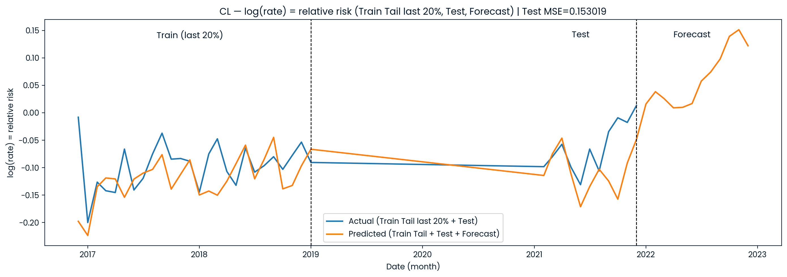

## Kolmogorov–Arnold Network (KAN)–Based Forecasting of Cutaneous Leishmaniasis in Antioquia, Colombia Using Relative Risk and Climate Signals

## Description
This repository implements a short‑horizon forecasting pipeline for cutaneous leishmaniasis (CL) in Antioquia, Colombia. The model learns monthly log relative risk $y=\log\big((\text{cases observed}+1)/(\text{cases expected}+1)\big)$ and integrates autoregressive dynamics, seasonality, ENSO/climate signals, and simple ecological controls. A Kolmogorov–Arnold Network (KAN) is trained with Bayesian optimization and evaluated on a strictly chronological split (Train: 2007–2018; Validation: 2019–2020; Test: 2021). The pipeline saves all artifacts (model, scaler, features, lags, logs, metrics, forecasts with dates) for full reproducibility and supports adaptive 12‑month forecasting.

## Overview
- Target: log(relative risk) (RR), centered at $0$ ($RR=e^{y}=1$). $y>0$ ($RR>1$) = above expected; $y<0$ ($RR<1$) = below expected.
- Features:
  - Autoregressive lags of $y$ at $t-1, t-2, t-3, t-6, t-12$.
  - Climate/ENSO lags (SST3, SST4, SST34, SST12, Esoi, soi, NATL, SATL, TROP) selected via cross‑correlation (top 3 leads from 1–9 months).
  - Seasonality: $\sin(2\pi m/12), \cos(2\pi m/12)$.
  - ENSO regime one‑hot (Neutral, La Niña, El Niño) and static altitude ($\text{minmasl}$).
- Model: Kolmogorov–Arnold Network (KAN) with $[input_{dim}, hidden_{dim}, 1]$ and spline‑based activations (controlled by $grid$ and $k$).
- Tuning & training: Bayesian optimization of $(hidden_{dim}, grid, k, lr, epochs)$; mini‑batch Adam, mixed precision (if GPU), early stopping on Validation.
- Forecasting: adaptive multi‑step (12 months), rolling forward per municipality; predicted $y$ is fed back as a lag and climate indices are held constant (baseline scenario).
- Aggregation & plots: municipal predictions/targets are averaged by month to a department‑level series with real calendar dates on the x‑axis.

## Data
- Source [[1](https://data.mendeley.com/datasets/cgxfzwrg7h/1)]
- Scope: monthly, municipality‑level panel (Colombia; 2007–2021).
- Key columns: cases observed, cases expected, year, month, Period (monotonic month index), CodeDANE (municipality), phenomenon2 (ENSO regime), minmasl (altitude), and climate indices (SST3, SST4, SST34, SST12, Esoi, soi, NATL, SATL, TROP).
- Study subset (this repo): Antioquia (DeptCode = 5) and municipalities with $\text{minmasl}<1700$. ID normalization and per‑municipality interpolation (with edge fills) are applied to continuous series.

## Methods
1. Supervised design
   - Build $(X_t, y_{t+1})$ per municipality once lag history is available; concatenate across municipalities.
   - Split by year to avoid leakage: Train (≤2018), Validation (2019–2020), Test (2021).
   - Fit StandardScaler on Train features only; apply to Validation/Test.
2. Feature engineering
   - $y$‑lags: $t-1, t-2, t-3, t-6, t-12$.
   - Climate/ENSO lags via CCF on aggregated series (top 3 leads per index; 1–9 months).
   - Seasonality: $ \sin(2\pi m/12), \cos(2\pi m/12) $; ENSO regime one‑hot; altitude.
3. Modeling and tuning
   - KAN with width $[input_{dim}, hidden_{dim}, 1]$; $grid$ and $k$ control spline flexibility.
   - Bayesian optimization for $(hidden\_dim, grid, k, lr, epochs)$ on Validation MSE.
   - Final KAN retrained on Train+Validation with early stopping; evaluated on Test.
4. Forecasting and visualization
   - Adaptive 12‑month roll‑forward per municipality (feed predicted $y$ as lag; climate held constant).
   - Aggregate to department‑level mean for plotting with calendar dates (Train tail last 20%, Test, Forecast).

## Results
- Panel: 113 municipalities (Antioquia), 20,340 records post‑filter, 18,871 supervised samples, 38 features.
- Tuning: best KAN around $hidden\_dim\approx29$, $grid=3$, $k=3$, $lr=0.002$, epoch cap ≈33 (Validation MSE ≈ $0.1666$).
- Final performance: Test MSE ≈ $0.153$ on log(RR).
- Interpretation: historical/Test segments are predominantly below $0$ (months with $RR<1$); the 12‑month forecast rises above $0$ ($RR>1$), indicating above‑expected activity under a baseline climate assumption.
- All artifacts saved: model state/config, scaler, full feature list/order, lags, hyperparameter logs, metrics, forecasts (with dates), and stage‑wise timings.

## Graphical summary

_Figure_: Department‑level mean log relative risk (blue = actual; orange = predicted). Dashed lines mark transitions between Train tail, Test, and Forecast; the x‑axis shows calendar months.

---

## License
This project is released under the MIT License.

---

## Questions?
For questions, suggestions, or collaboration, please open an issue in this repository or email me at jprmaulion[at]gmail[dot]com.

